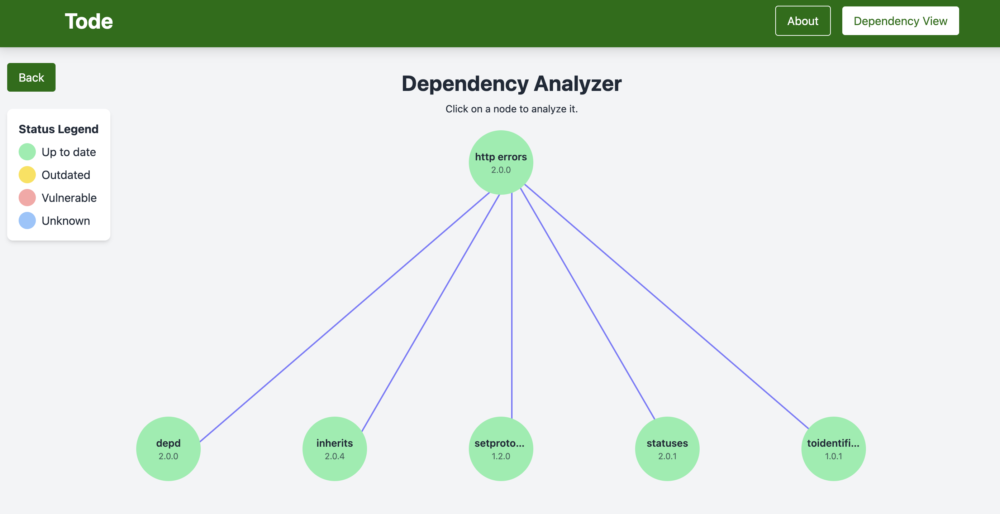

# Tode Client

The **Tode Client** is a React-based frontend application that allows users to visualize the dependency structure of their Node.js projects. Users can upload a `package.json` file to generate an interactive, D3.js-powered tree diagram of direct and nested dependencies.




---

## Features

- **Upload & Analyze**: Easily upload a `package.json` file to parse and visualize dependencies.
- **Interactive Visualization**: View your Node.js dependency tree dynamically using D3.js.
- **Responsive Design**: Optimized for use across desktop and mobile devices.
- **Lightweight Frontend**: Built with Vite, React, and Tailwind CSS for fast loading and minimal bundle size.

---

## Getting Started

Follow these instructions to set up and run the client-side application locally.

### Prerequisites

- [Node.js](https://nodejs.org/) (version 14+)
- [npm](https://www.npmjs.com/) or [yarn](https://yarnpkg.com/)

---

### Installation

1. Clone the repository:
   ```bash
   git clone https://github.com/yourusername/node-dependency-walker-client.git
   cd node-dependency-walker-client

2. Install dependencies:
   ```bash
   npm install
   ```

## Running the Application

Start the development server:
```bash
npm run dev
```

## Build for Production

To create a production build:
```bash
npm run build
```

## Dependencies
- React: Component-based UI framework.
- Tailwind CSS: Utility-first CSS framework for responsive and modern design.
- D3.js: Library for creating data visualizations.
- Vite: Fast build tool and development server.

## Future Enhancements
- Add support for real-time dependency analysis via API integration.
- Improve the visualization with search and filtering capabilities.
- Include metadata such as package versions and sizes in the visualization.
